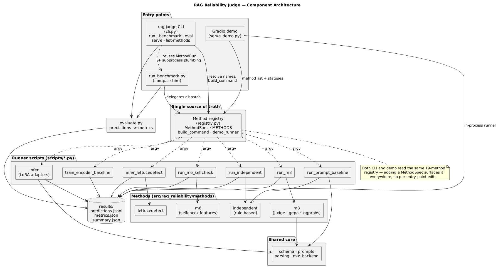
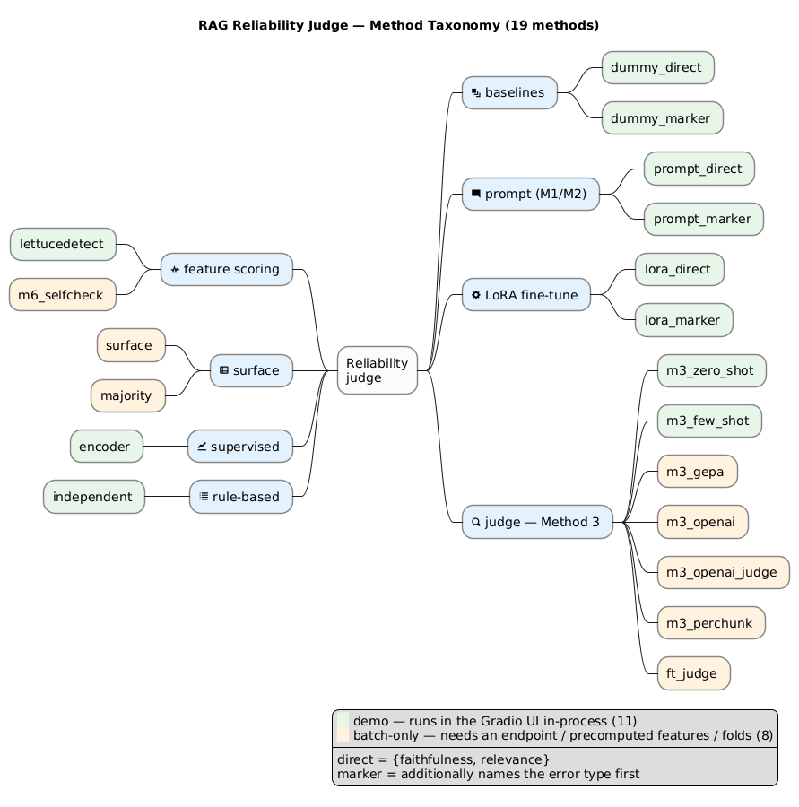
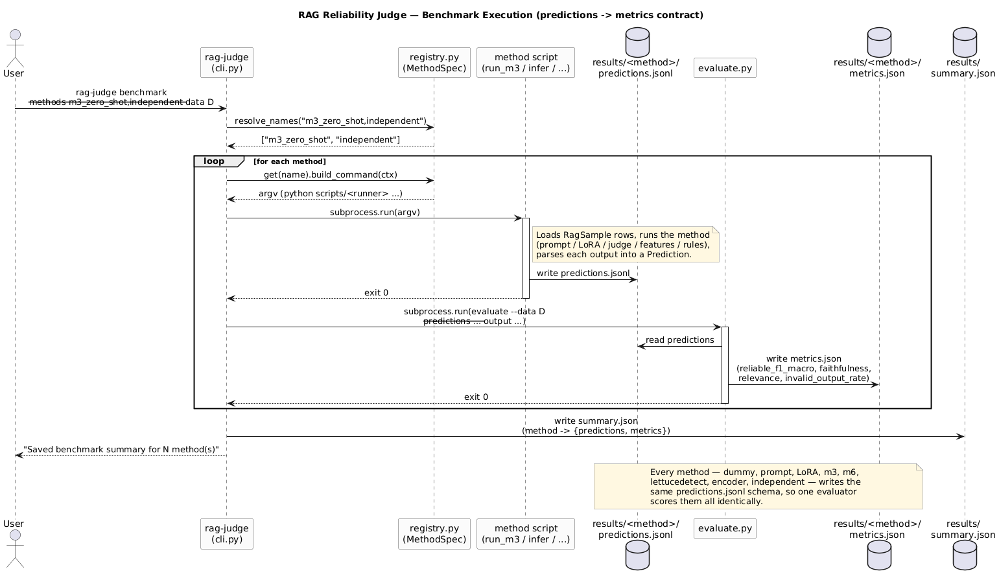

<div align="center">

# rag-reliability-judge

**Does a RAG system's answer actually hold up against its context?**
One registry of methods, one `rag-judge` CLI, one `predictions → metrics` contract.


</div>

---

Part of the team project **"Assessing the Reliability of Responses in RAG
Systems"** @SMILES-2026. Given a `QUESTION`, its `CONTEXT`, and an `ANSWER`,
every method predicts whether the answer is reliable, where

```
reliable = faithfulness AND relevance
```

**faithfulness** = the answer is supported by the context (no hallucination);
**relevance** = the answer actually addresses the question. Fifteen methods —
from a zero-config dummy baseline to LoRA-tuned and Method 3/6 LLM judges —
compete through a single shared contract, so their scores are directly
comparable.

## Contents

- [How it works](#how-it-works)
- [Quickstart](#quickstart)
- [Methods](#methods)
- [The pipeline](#the-pipeline)
- [Results](#results)
- [Metrics](#metrics)
- [Advanced / pipelines](#advanced--pipelines)
- [Status](#status)
- [Documentation map](#documentation-map)
- [Project layout](#project-layout)

## How it works

All methods are registered in one place
([`src/rag_reliability/methods/registry.py`](src/rag_reliability/methods/registry.py))
and driven through a single CLI, `rag-judge`. The registry is the single
source of truth: the CLI, the `run_benchmark` shim, and the Gradio demo all
read from it, so adding a method surfaces it everywhere at once.



## Quickstart

Requires Python ≥ 3.11. Target hardware: Apple Silicon (MLX); everything
except the `mlx` backend runs anywhere.

```bash
make install        # uv venv + core/dev deps — installs the `rag-judge` console script
make check          # tests + lint
```

<details>
<summary>Optional extras and no-make install</summary>

```bash
make install-mlx                # Apple Silicon: mlx backend + LoRA
make install-lettucedetect      # LettuceDetect feature method
make install-encoder            # RuModernBERT supervised baseline
make install-m6                 # Method 6 NLI/embedding features
make install-cloud              # OpenAI-compatible Method 3 backend
make install-demo               # local Gradio demo UI
make help                       # all shortcuts: dummy, baselines, LoRA, eval
```

Without make:

```bash
uv venv --python 3.12 && uv pip install -e ".[dev]"
```

</details>

List every registered method, its family, and what it requires:

```bash
rag-judge list-methods
```

Smoke-test the pipeline without any model (dummy backend, no downloads):

```bash
rag-judge run --method dummy_marker --data data/dummy.jsonl --output-dir results/run
```

Run several methods through the shared predictions → metrics contract
(`--methods all` runs every registered method):

```bash
rag-judge benchmark --methods dummy_direct,dummy_marker --data data/dummy.jsonl --output-dir results/benchmark_dummy
```

Each run writes `predictions.jsonl` and `metrics.json` per method plus a
`summary.json` in `--output-dir`.

Real zero-shot baseline (downloads ~840 MB once), then score any predictions
file against gold labels directly:

```bash
rag-judge run --method prompt_direct --data data/dummy.jsonl --output-dir results/run
rag-judge eval --data data/dummy.jsonl --predictions results/run/prompt_direct/predictions.jsonl --output results/run/prompt_direct/metrics.json
```

Launch the local Gradio demo UI:

```bash
make install-demo
rag-judge serve
```

The demo accepts `question`, `context`, `answer`, optional gold labels, and a
method selector sourced from the same registry as the CLI. Methods missing an
artifact or dependency report a clear unavailable status instead of crashing.
It also supports dataset presets, side-by-side method comparison, raw-output
inspection, run history, and batch benchmark command generation.

## Methods

Fifteen methods across seven families. Green nodes run in the Gradio demo
in-process; orange ones are batch-only (need an endpoint, precomputed
features, or an evolved prompt).



| Method | Family | What it needs | In demo? |
|---|---|---|---|
| `dummy_direct` | dummy | — | yes |
| `dummy_marker` | dummy | — | yes |
| `prompt_direct` | prompt | MLX model | yes |
| `prompt_marker` | prompt | MLX model | yes |
| `lora_direct` | lora | `results/adapters_direct` | yes |
| `lora_marker` | lora | `results/adapters_marker` | yes |
| `lettucedetect` | lettucedetect | `results/lettucedetect/classifier.joblib` | yes |
| `encoder` | encoder | `results/encoder_checkpoints_512_best` | yes |
| `m3_zero_shot` | m3 | MLX model | yes |
| `m3_few_shot` | m3 | `configs/few_shot.yaml` | yes |
| `m3_gepa` | m3 | evolved prompt file | batch-only |
| `m3_openai` | m3 | OpenAI-compatible endpoint | batch-only |
| `m3_openai_judge` | m3 | OpenAI-compatible endpoint | batch-only |
| `m6_selfcheck` | m6 | `results/m6/features.jsonl` | batch-only |
| `independent` | independent | — | yes |

This table mirrors `registry.METHODS`; run `rag-judge list-methods` for the
same information straight from the code.

<details>
<summary>Method families in one line each</summary>

- **Method 1 — direct** (`mode=direct`): the model outputs
  `{"faithfulness": 0|1, "relevance": 0|1}`.
- **Method 2 — marker** (`mode=marker`): the model names the error type first:
  `{"marker": "...", "faithfulness": 0|1, "relevance": 0|1}`.
- **LettuceDetect features**: token-level scores aggregated into three
  features, then a logistic regression predicts faithfulness and relevance.
- **Method 3 judge** (`m3_*`): a prompt judge in zero-shot, few-shot, GEPA, and
  OpenAI-endpoint variants; `m3_openai_judge` scores via token logprobs.
- **Method 6 SelfCheck** (`m6_selfcheck`): consumes a precomputed feature JSONL;
  sample generation, NLI scoring, and calibration stay explicit prep steps.
- **Supervised encoder**: a RuModernBERT reliability classifier.
- **Independent rule-based**: heuristic thresholds over faithfulness/relevance
  signals, no model required.

</details>

## The pipeline

`rag-judge benchmark` resolves the requested methods, builds each one's command
from the registry, runs it as a subprocess to produce `predictions.jsonl`, then
scores every method with the same evaluator. Because all families converge on
one `Prediction` schema, the evaluator treats them identically.



See [docs/diagrams/](docs/diagrams/README.md) for the source `.puml` files and
a per-sample data-flow diagram.

## Results

On the organizer dataset (2245 rows, ~72% reliable), reliability macro-F1 —
numbers traceable to [docs/experiments.md](docs/experiments.md):

| Method | Reliability macro-F1 | Notes |
|---|---:|---|
| Trivial floor (`always_reliable`) | 0.4194 | majority-class baseline |
| Qwen zero-shot, direct (Method 1) | 0.4946 | 0% invalid output |
| **RuModernBERT encoder (best)** | **0.5879** | 512 tok, 3 epochs, lr 2e-5, no weighting, tuned threshold 0.72 |

On the 36-sample dummy set, zero-shot direct reaches `reliable_f1 = 0.86`
(toy scale — see the experiments doc for caveats).

## Metrics

Reported by `rag-judge eval` (`scripts/evaluate.py`):

- **`reliable_f1_macro`** — primary metric
- `faithfulness_f1_macro`, `relevance_f1_macro`
- `invalid_output_rate` — outputs unparseable even with fallbacks; counted
  conservatively as `faithfulness=0, relevance=0`
- marker mode only: `marker_f1_macro`, `marker_per_class_f1`,
  `marker_confusion` (gold → predicted counts)

## Advanced / pipelines

Training and data-prep steps produce artifacts (adapters, checkpoints,
converted datasets, evolved prompts) that the methods above consume. They are
not part of the `run`/`benchmark`/`eval` contract, so they stay as raw script
invocations.

<details>
<summary>Data prep + supervised encoder baseline</summary>

```bash
python scripts/prepare_data.py \
  --input from_organizators/data/data.zip \
  --output data/organizers.jsonl

python scripts/train_encoder_baseline.py \
  --data data/organizers.jsonl \
  --output results/encoder_baseline_512_best_metrics.json \
  --output-dir results/encoder_checkpoints_512_best \
  --max-length 512 --batch-size 4 \
  --epochs 3 --learning-rate 2e-5 --pos-weight-mode none
```

</details>

- **LoRA training** (`train_direct_lora.py` / `mlx_lm.lora`): see
  [docs/training.md](docs/training.md).
- **GEPA prompt evolution** (`run_gepa.py`, produces the prompt consumed by
  `m3_gepa`): see [docs/m3_m6.md](docs/m3_m6.md).

## Status

- ✅ Pipeline (data → prompt → inference → parsing → metrics) built and verified
  end-to-end: dummy backends, zero-shot MLX baseline, LoRA training + adapter
  inference — all with 0% invalid outputs.
- ✅ Organizer CSV/ZIP dataset format supported by `prepare_data.py`.
- ✅ Organizer encoder baseline reproducible at `max_length=512` with a held-out
  test set, no class weighting, 3 epochs, and a validation-selected threshold.
- ✅ Method 3/6 code from `m3-m6` integrated selectively into the shared
  prediction/evaluation contract without replacing the package layout.
- ✅ All 15 methods registered in `methods/registry.py` and reachable through the
  `rag-judge` CLI (`run`, `benchmark`, `eval`, `serve`, `list-methods`); 11 are
  also wired into the Gradio demo.
- ⏳ Next: real Method 1 vs Method 2 fine-tuning comparison and targeted
  hyperparameter tuning around the 512-token encoder setup.

## Documentation map

| Doc | What's inside |
|---|---|
| [docs/architecture.md](docs/architecture.md) | Pipeline, module map, design decisions (conservative parsing, chat-template symmetry, 4-bit model, dependency pins) |
| [docs/data.md](docs/data.md) | Sample schema, marker vocabulary, dummy dataset, plugging in the real dataset |
| [docs/training.md](docs/training.md) | LoRA workflow, configs, why `--mask-prompt`, scaling up |
| [docs/lettucedetect.md](docs/lettucedetect.md) | LettuceDetect feature extraction + logistic regression |
| [docs/m3_m6.md](docs/m3_m6.md) | Selective Method 3/6 port from the `m3-m6` branch |
| [docs/experiments.md](docs/experiments.md) | All results so far, how to reproduce, environment gotchas |
| [docs/diagrams/](docs/diagrams/README.md) | PlantUML architecture, benchmark pipeline, method taxonomy, and sample data-flow diagrams |
| [notebooks/qwen7b_full_finetune.ipynb](notebooks/README.md) | Full fine-tune Qwen2.5-7B on Method 1/2 in Colab/Kaggle/DataSphere (GPU cloud) |

## Project layout

```
data/dummy.jsonl        36 synthetic Russian banking RAG examples
configs/                LoRA training configs (direct, marker)
src/rag_reliability/    schema, prompts, formatting, parsing, metrics,
                        dataset IO, dummy predictors, mlx backend, methods,
                        method registry, rag-judge CLI
scripts/                CLI entry points — run from repo root
tests/                  unit tests (135, no MLX required)
docs/                   architecture / data / training / experiments / diagrams
results/                predictions, metrics, adapters (gitignored)
```
